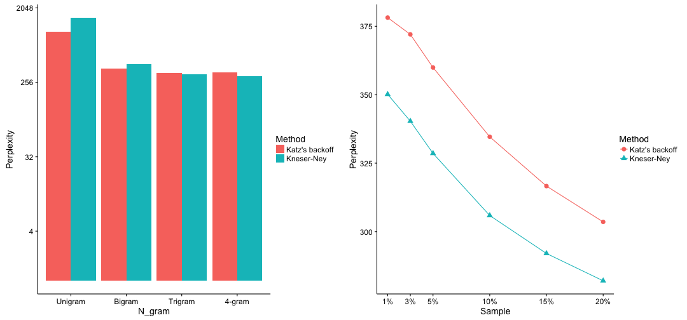

Data Science Capstone - Word Prediction App
========================================================
author: Amit Kohli
date: April 18, 2016
autosize: true

Capstone Objective
========================================================

1. Using a freely downloadable English text corpus, build a **Predictive Text Model** that takes in sentence fragments as input and output prediction of the **next word**.
2. The training corpus is sampled from HC Corpora which comprises 102 million words & 7 million English sentences taken from 3 online sources namely Blogs, News and Tweets.
3. The model uses conditional probability. In the example of a 2-gram, if the first word is *Good*, it looks for the probability that the next word would be *Morning* using the following formula. 
$$P(\mbox{Morning}|\mbox{Good}) = \frac{P(\mbox{Good Morning})}{P(\mbox{Good})}$$
4. The model searches a dataset consisting of 1-grams, 2-grams, 3-grams and 4-grams.
5. Develop interactive Shiny Application to demonstrate capabilities of the predictive alogrithm

Method
========================================================

**Katz's backoff**

$P_{Katz}(w_{i}\mid w_{i-n+1}^{i-1}) =$

$$\begin{cases} 
d \cdot P_{MLE}(w_{i}\mid w_{i-n+1}^{i-1}) \\ _{\text{if } C(w_{i-n+1}^{i})>0} \\ \\
\lambda \cdot P_{Katz}(w_{i}\mid w_{i-n+1}^{i-2}) \\ _{\text{otherwise}} 
\end{cases}$$
<ul style="font-size:50%;line-height:120%">
<li>Maximum Likelihood Estimate (MLE): 
Count of n-gram divided by total count across all n-grams having the same context</li>
<li>d = discount factor</li>
<li>&#955 = probability mass shifted</li>
<li>Uses discounted MLE for observed n-grams. Backoff to smaller n-gram for n-grams not observed in training</li>
</ul>

***

**Kneser-Ney** (Interpolation)
$$\begin{align*}P_{KN}(w_{i}\mid w_{i-n+1}^{i-1})
&= \frac{C(w_{i-n+1}^{i})-D}{\sum_{w_{i}}C(w_{i-n+1}^{i})} \\
&+ \lambda \cdot P_{KN}(w_{i}\mid w_{i-n+1}^{i-2}) \end{align*}$$

$\text{where } C(w_{i-n+1}^{i}) =$

$$\begin{cases} 
\text{freq count} & _{\text{highest order}} \\ 
\text{N(unique histories)} & _{\text{lower orders}} 
\end{cases}$$
  
<ul style="font-size:50%;line-height:120%">
<li>Count is discounted to shift some probability mass to lower-order model for interpolation</li>
<li>
Probability estimate of lower-order n-grams obtained by counting no. of unique histories instead of taking MLE
</li>
</ul>

Performance
========================================================
In order to boost performance without checking user input against more data, which would create lag, the model displays the top tep predicted outcomes instead of one. This is standard on many smart device keyboards, and it increases the efficacy of the model without affecting speed, as the plot below shows:

The Learning Model
========================================================

<ul style="font-size:70%;line-height:100%">
<li>Model evaluated using Perplexity</li>
<li>Perplexity continues to decrease as size of training set increases</li>
<li>Lowest perplexity achieved on a 10% sampling of training corpus using a 4-gram Kneser-Ney model</li>
</ul>
